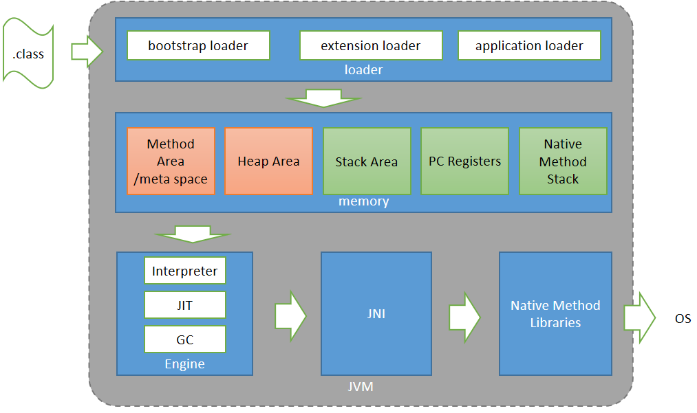

# Java探幽： 1+1=2是怎么运行的？

本文通过一个简单的Java程序，来学习一下Java程序的执行内部过程。程序功能非常简单，就是计算1=1=2，代码如下：
```java
public class JavaGo {

    public int add(int i1, int i2) {
        return i1 + i2;
    }

    public static void main(String[] args) {
        int sum = new JavaGo().add(1, 1);
        System.out.println(sum);
    }
}
```

可以看出上面这段简单的程序中，我们定义了如下几个关键部分：

* 一个类JavaGo。
* 一个成员方法add,包含两个参数，一个返回值。
* 一个静态方法main。

然后
编译此代码文件，生成字节码文件JavaGo.class。

## 字节码

通过idea插件jclasslib看一下字节码的内容，


可以看到其中包含这个class的基本信息，常量池，还有接口、成员变量、方法、属性等。
其中常量池定义了本类中代码**操作码**使用到的常量，包括类名，变量名，字符串，常量数等。
我们来看看常量池中的内容：


我们再看看main函数的操作码：
```html
 0 new #2 <JavaGo>
 3 dup
 4 invokespecial #3 <JavaGo.<init>>
 7 iconst_1
 8 iconst_1
 9 invokevirtual #4 <JavaGo.add>
12 istore_1
13 getstatic #5 <java/lang/System.out>
16 iload_1
17 invokevirtual #6 <java/io/PrintStream.println>
20 return
```
其中操作码中的#n就表示引用的是常量池中的第n个常量。
字节码的解释到此为止。下面我们开始运行这段代码。
>java -cp .\ JavaGo
输出为2

这段程序的背后到底发生了什么呢？

## JVM
先来看看JVM的架构图：


JVM整体分为5个模块：

### 1.Class Loader：类装载器。

   类装载包含如下三个步骤：
   * Loading : 装载.class文件，将类定义信息：类名、方法名、变量名等存入Method Area。
   * Linking：链接。包含如下3个阶段：
     * Verification： 校验。
     * Preparation：  准备，主要是给变量分配内存。
     * Resolution ：  解析，主要是替换变量名为直接引用。
   * Initialization : 初始化。主要是给静态变量赋值。
     

### 2.JVM memory：存储器。

   包含五部分：
   * Method Area/Metaspace: 方法/元数据空间，每个JVM一个，存放共享资源。包括各种类定义信息：类名，父类命，方法，变量等元信息，以及静态变量。
   * Heap Area：堆空间，每个JVM一个，存放所有对象实例。
   * Stack Area： 栈空间，每个线程一个，存放方法调用，方法内部变量等。每个对象类型的内部变量维护一个引用（句柄),指向堆空间的实例。
   * PC Registers:寄存器，每个线程一组，存放当前线程的运行指令。
   * Native method stacks :本地调用栈，每个线程一个，存放native方法信息。

### 3.Execution Engine：执行引擎。

包含如下三个模块：
   * Interpreter: 翻译器，线性翻译执行字节码指令。
   * JIT： 编译器，将频繁调用的字节码编译成机器码，提高效率。
   * GC：垃圾回收器。
   
### 4.JNI： 本地库调用接口。

### 5.Native Method Libraries： 本地库（C/C++）。

通过对JVM内部架构的了解，我们看到一个Java程序主要是通过类装载器装载.class文件，
然后解析出元数据，存储到内存中，再通过执行引擎，解释执行字节码指令，继而调用本地库来完成计算。

## 监控
最后通过Java自带的工具JVisualvm来监控一下我们的程序：


可以看到内存堆空间里已经生成了一个我们定义的对象实例。


### 参考列表

https://www.geeksforgeeks.org/jvm-works-jvm-architecture/